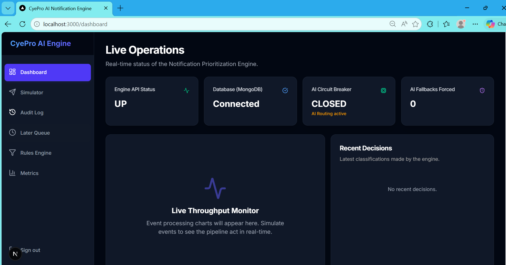
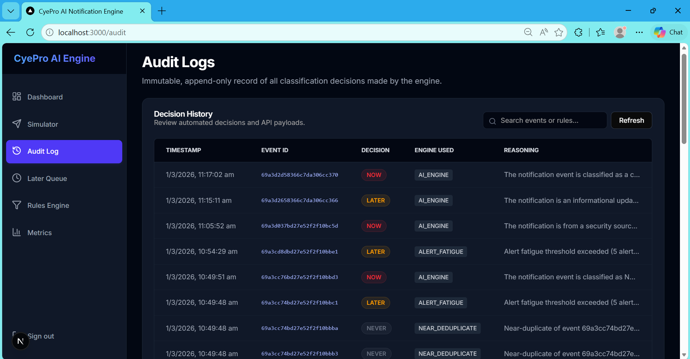
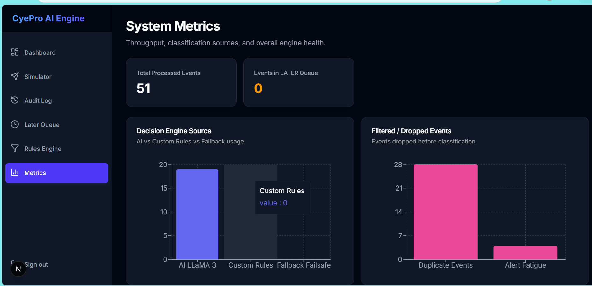

# CyePro Notification Prioritization Engine (MERN Stack)

This repository contains the Node.js/MongoDB reference implementation of the CyePro Notification Prioritization Engine.

## 🚀 Live Deployments
- **Frontend (Vercel):** `[INSERT_VERCEL_URL]`
- **Backend (Render/Railway/AWS):** `[INSERT_BACKEND_URL]`
- **System Health Endpoint:** `[INSERT_BACKEND_URL]/api/health`

*Note: The deployed database is seeded. Any reviewer can log into the dashboard immediately without creating an account. The credentials are provided directly on the login screen.*

---

## 🛠️ Local Development Setup (Get Running in 2 Minutes)

Follow these exact steps to run the complete MERN engine on your local machine.

### 1. Prerequisites
- **Node.js**: v20 or v18 installed.
- **Database**: Access to a MongoDB instance (Atlas Cloud URI or Local).
- **AI Key**: A valid [Groq API Key](https://console.groq.com/).

### 2. Backend Installation & Start
```bash
# Navigate to backend
cd mern-stack/backend

# Install all dependencies
npm install

# Create environment file
touch .env
# Paste the following into .env (replace with your keys):
# MONGO_URI=mongodb+srv://...
# GROQ_API_KEY=gsk_...
# GROQ_MODEL=llama-3.3-70b-versatile
# PORT=5000

# Start server
npm run dev
```
*The API will be live at `http://localhost:5000`.*

### 3. Frontend Installation & Start
```bash
# Navigate to frontend (in a new terminal window)
cd mern-stack/frontend

# Install all dependencies
npm install

# Start development server
npm run dev
```
*The Dashboard will be live at `http://localhost:3000`.*

---

## 💻 Tech Stack Justification

- **Node.js (v20) + Express (v4.19):** Chosen because its event-driven, non-blocking asynchronous I/O model is perfect for handling thousands of incoming API webhook requests without blocking threads.
- **MongoDB (Mongoose v8.2):** Chosen because notification payloads (`metadata`, `event_type`) are inherently unstructured and subject to change; a document DB allows schema flexibility without forced migrations.
- **Next.js (v14 - App Router) + React:** Chosen for the frontend framework because Server-Side Rendering (SSR) capabilities make the dashboard highly responsive and Vercel deployment seamless.
- **Tailwind CSS + Framer Motion:** Chosen to radically accelerate the creation of a premium, "dark mode", mobile-responsive UI with smooth micro-animations.
- **Agenda (v5.0):** Chosen for lightweight, MongoDB-backed background job scheduling to periodically process the `LATER` deferred queue without needing external infrastructure like Redis.

---

## 🏗️ Architecture Overview

The system follows a typical 3-tier REST architecture:
1. **Presentation Layer (Frontend):** A Next.js application that polls the backend `/api/metrics` and provides an Event Simulator for manual payload injection.
2. **Application Layer (Express / Node.js):** The core routing engine containing the 5-Stage Classification Pipeline. It validates input, queries MongoDB, runs the algorithm, orchestrates the background AI calls, and handles the manual Circuit Breaker state.
3. **Data Layer (MongoDB):** Stores the raw `NotificationEvent`, the immutable `AuditLog`, the dynamically evaluated admin `Rules`, and handles the persistence of the deferred LATER queue for the `Agenda` workers.

### The Decision Pipeline Flow
1. An incoming JSON event is intercepted by the Express router.
2. The controller creates a `PENDING` event in MongoDB and responds immediately with `HTTP 202 Accepted` to the client.
3. The event enters the background loop:
   - **Stage 1 & 2 (Deduplication):** The engine queries Mongo for the user's events in the last hour. It runs a Sorensen-Dice bi-gram comparison against the incoming message. If >85% similar, it drops it.
   - **Stage 3 (Fatigue):** If the user has >5 alerts in the last hour, it routes to `LATER`.
   - **Stage 4 (Rules):** It fetches active admin rules from Mongo and performs string evaluations to see if an explicit bypass is required.
   - **Stage 5 (AI Fallback):** If no rules match, it calls the LLM.
4. The final decision updates the event status (`PROCESSED`, `DROPPED`, `LATER_QUEUE`) and writes an immutable `AuditLog` row summarizing the logic path.

---

## 🤖 AI Integration

### Provider & Model
We utilize the **Groq SDK** calling the `llama-3.3-70b-versatile` model. 

### The Prompt Template
```javascript
const prompt = `You are the CyePro Notification Prioritization Engine.
Classify the following event as: 'NOW' (immediate action), 'LATER' (deferred), or 'DROPPED' (spam/unimportant).
Provide a priority score (0.0 to 1.0) and a concise reasoning string.
Event Data: ${JSON.stringify(eventData)}.
Respond EXACTLY in this JSON format and nothing else: {"decision": "NOW|LATER|DROPPED", "score": 0.0, "reason": "...", "confidence": 0.0}`;
```

### Parsing & Usage
Groq returns a highly structured natural language string strictly constrained to the requested JSON map. The backend parses this string `JSON.parse(completion.choices[0].message.content)` and extracts the `decision` to route the event status, storing the `reason` and `confidence` permanently into the Postgres `AuditLog` table so a human admin can review *why* the AI made the choice it did on the dashboard.

### Failure Handling (Circuit Breaker)
If the Groq API times out, returns a 5xx error, or fails to parse three times consecutively (`failureCount >= 3`), the manual Circuit Breaker trips `OPEN`.
1. The AI network call is hard-bypassed.
2. The event is routed to an internal heuristic `getFallbackDecision()` method.
3. The fallback routes to `NOW` if the event contains hardcoded keywords (`"SECURITY"`, `"critical"`), otherwise defaulting to `LATER`.
4. The `AuditLog` records `engine_used = FALLBACK_ENGINE`.
5. The `/api/health` endpoint turns red on the dashboard to alert the operator.

---

## 🖼️ Visual Evidence

### System Dashboard

*Real-time monitoring of system health, AI classification trends, and event throughput.*

### Event Simulator

*Manual testing interface for injecting notification payloads and observing engine decisions.*

### Audit Logs & Reasoning

*Immutable history of every decision, including AI confidence scores and reasoning strings.*

### Performance Metrics

*Detailed breakdown of engine utilization and pipeline latency.*

---

## ⚠️ Known Limitations

- **Scalability of Semantic Deduplication:** The Sorensen-Dice string calculation happens perfectly in-memory for the last hour of user data. However, at extreme scale (e.g., millions of events per second per user), this $O(N)$ string comparison will block the Node Event Loop. A production version would compute a MinHash signature at ingestion time and use Locality-Sensitive Hashing (LSH) directly inside the database query.
- **Polling Agenda Worker:** The LATER queue is processed via database polling (every 60 seconds). Under immense load, scanning a massive `NotificationEvents` collection for expired timestamps causes database contention. A production system would utilize an event-driven delayed queue (like AWS SQS Visibility Timeouts or RabbitMQ Delayed Messages).
- **Security & Auth:** We implemented a simulated login to allow easy access for reviewers. In production, we would integrate NextAuth (Auth.js) securely backing JWTs or OAuth providers, tying specific audit logs to specific authenticated users.
